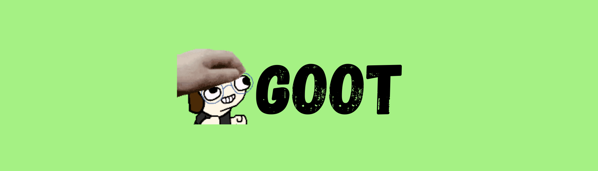

</img>

<h1>Goot! The bot made by you.</h1>


[](https://discord.gg/4SWmXNYsCS)
[](https://discord.com/api/oauth2/authorize?client_id=784903173767823370&permissions=8&scope=applications.commands%20bot)
[](https://opensource.org/licenses/MIT) 


## Installing the [npm modules](https://npmjs.com)

```sh
npm install <module name>
```

## Running the bot
```sh
node .
```

## .env file
```json
token=
```


## Open Source

As this project is a TeamNorden project, the TeamNorden license applies.

However, the following conditions are voided for Goot:
> You waive Your rights to any material which you contribute towards the repository, you do not gain any ownership over the repository or material within it nor do you retain any rights to the material which you contributed.

***What can i do with this code?***

You are allowed to use and add-to this code to help make the bot better.

***Can I claim what i add as MY code?***

Yes! However you cannot claim my portions as yours.

***When will this code be updated?***

I will do my best to update the code when i get a full feature made. I will have a folder of test features i'm working on that you can help with.

