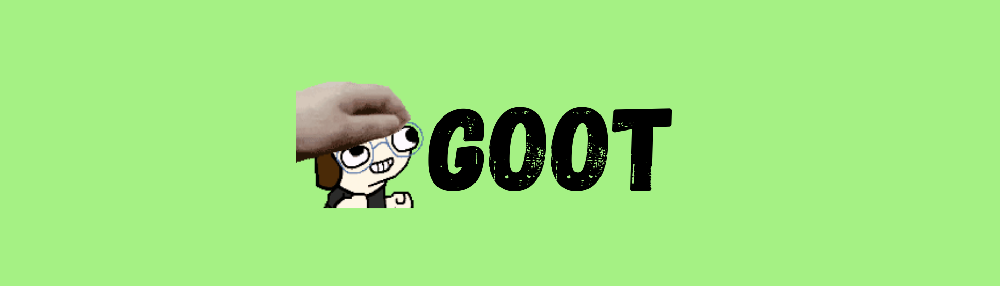

</img>

<h1>Goot! A bot you control.</h1>

 

## Open Source

***What can i do with this code?***

You are allowed to use and add-to this code to help make the bot better.

***Can I claim what i add as MY code?***

Yes! However you cannot claim my portions as yours.

***When will this code be updated?***

I will do my best to update the code when i get a full feature made. I will have a folder of test features i'm working on that you can help with.
